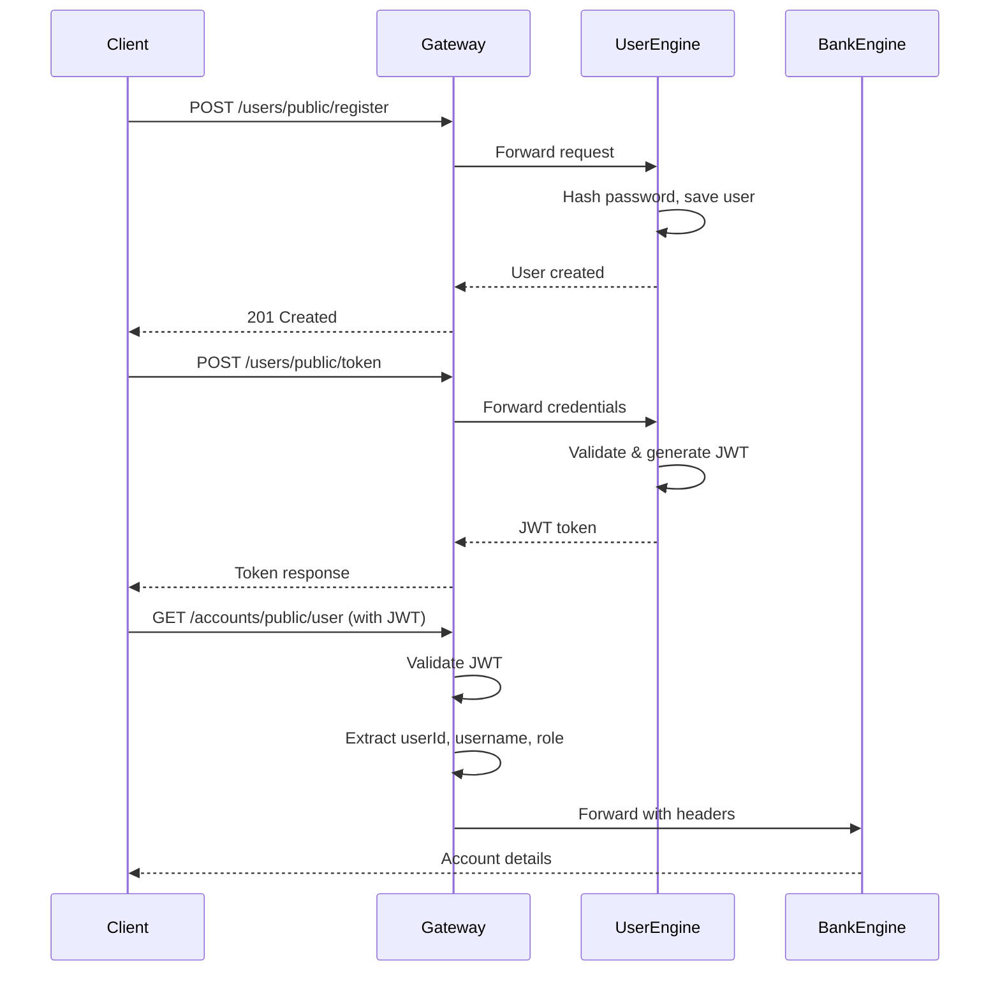

# 🏦 Bank Payment System - Microservices Architecture

> **A production-ready, enterprise-grade banking microservices system built with Spring Boot, featuring comprehensive exception handling, logging, security, and rate limiting.**

[](https://www.oracle.com/java/)
[](https://spring.io/projects/spring-boot)
[](https://microservices.io/)
[](LICENSE)

---

## 📋 Table of Contents

- [Overview](#-overview)
- [Architecture](#-architecture)
- [Technology Stack](#-technology-stack)
- [Features](#-features)
- [Project Structure](#-project-structure)
- [Quick Start](#-quick-start)
- [API Documentation](#-api-documentation)
- [Security](#-security)
- [Monitoring & Logging](#-monitoring--logging)
- [Production Readiness](#-production-readiness)
- [Future Enhancements](#-future-enhancements)

---

## 🎯 Overview

This is a **fully functional microservices-based banking system** that demonstrates enterprise-level architecture patterns, security best practices, and production-ready features. The system handles user management, account operations, transactions, and administrative functions through a unified API Gateway.

### **Key Highlights**

- ✅ **5 Microservices** - User, Bank, Transaction, Admin, API Gateway
- ✅ **Service Discovery** - Eureka for dynamic service registration
- ✅ **API Gateway** - Centralized routing with JWT authentication
- ✅ **Refresh Tokens** - 7-day validity for seamless token renewal
- ✅ **Android Client** - Native Android app with Retrofit integration
- ✅ **Production-Grade Logging** - Comprehensive logging across all services
- ✅ **Exception Handling** - Structured error responses with custom exceptions
- ✅ **Input Validation** - Bean validation on all DTOs
- ✅ **Audit Trails** - Complete logging of admin operations
- ✅ **Security** - JWT-based authentication with role-based access control

---

## 🏗️ Architecture

### **System Architecture Diagram**

```
┌─────────────────────────────────────────────────────────────┐
│                         Client                               │
└────────────────────────┬────────────────────────────────────┘
                         │
                         ▼
┌─────────────────────────────────────────────────────────────┐
│              API Gateway (Port: 8080)                        │
│  • JWT Authentication  • Request Routing  • Logging          │
└──────┬──────────┬──────────┬──────────┬─────────────────────┘
       │          │          │          │
       ▼          ▼          ▼          ▼
┌──────────┐ ┌──────────┐ ┌──────────┐ ┌──────────┐
│  User    │ │  Bank    │ │Transaction│ │  Admin   │
│ Engine   │ │ Engine   │ │  Engine   │ │ Engine   │
│ :8081    │ │ :8082    │ │  :8083    │ │ :8084    │
└────┬─────┘ └────┬─────┘ └────┬──────┘ └────┬─────┘
     │            │            │             │
     └────────────┴────────────┴─────────────┘
                  │
                  ▼
        ┌──────────────────┐
        │ Eureka Discovery │
        │    (Port: 8761)  │
        └──────────────────┘
                  │
                  ▼
        ┌──────────────────┐
        │  MySQL Database  │
        │  • user_db       │
        │  • account_db    │
        │  • transaction_db│
        └──────────────────┘
```

### **Service Communication Flow**

1. **Client** → API Gateway (Authentication & Rate Limiting)
2. **API Gateway** → Service Discovery (Locate service)
3. **API Gateway** → Microservice (Route request)
4. **Microservice** → Database (Persist data)
5. **Microservice** → API Gateway → Client (Return response)

---

## 🛠️ Technology Stack

### **Backend**
- **Java 17** - Modern Java features
- **Spring Boot 3.x** - Microservices framework
- **Spring Cloud** - Microservices patterns (Gateway, Eureka)
- **Spring Security** - JWT authentication
- **Spring Data JPA** - Database abstraction
- **Hibernate** - ORM framework
- **MySQL 8.x** - Relational Database (Optimistic Locking enabled)

### **Database**
- **MySQL** - Relational database

### **Security**
- **JWT (JSON Web Tokens)** - Stateless authentication
- **BCrypt** - Password hashing
- **Spring Security** - Authorization framework

### **Monitoring & Logging**
- **SLF4J + Logback** - Logging framework
- **Lombok @Slf4j** - Simplified logging


### **Build Tools**
- **Gradle** - Build automation

---

## ✨ Features

### **1. User Management (User-Engine)**
- ✅ User registration with validation
- ✅ JWT-based authentication with **Refresh Tokens**
- ✅ Access Token: 30 minutes, Refresh Token: 7 days
- ✅ Token refresh endpoint (`/users/public/refresh-token`)
- ✅ Logout with token revocation
- ✅ Profile management (email, phone, address)
- ✅ Secure password reset (requires current password)
- ✅ KYC status management
- ✅ Role-based access (USER, ADMIN)

### **2. Account Management (Bank-Engine)**
- ✅ **Dynamic Account Creation** - Supports SAVINGS, CURRENT, BUSINESS, SALARY accounts
- ✅ **16-Digit Account Numbers** - Secure, numeric, standard-compliant generation
- ✅ **Smart Balance Initialization** - Pre-defined opening balances based on account type
- ✅ **Database-Driven Branch Management** - Dynamic branch allocation (HDFC Mumbai, Delhi, etc.)
- ✅ **Optimistic Locking** - Prevents concurrent balance modification conflicts (@Version)

### **3. Transaction Management (Transaction-Engine)**
- ✅ Fund transfers between accounts
- ✅ Deposits and withdrawals
- ✅ Idempotency key support (prevent duplicate transactions)
- ✅ **User Transaction History** (`/transactions/public/history?accountNo=X`)
- ✅ Balance validation before transactions
- ✅ Atomic operations with @Transactional

### **4. Admin Operations (Admin-Engine)**
- ✅ View all users
- ✅ View all transactions
- ✅ Role-based access control (ADMIN only)
- ✅ Comprehensive audit logging

### **5. API Gateway**
- ✅ Centralized routing
- ✅ JWT authentication & validation
- ✅ Request/response logging
- ✅ Public endpoint bypass
- ✅ Header injection (X-User-Id, X-User-Name, X-User-Role)

### **6. Service Discovery (Eureka)**
- ✅ Dynamic service registration
- ✅ Health monitoring
- ✅ Load balancing support

---

## 📁 Project Structure

```
bank-payment-system/
├── discovery-engine/          # Eureka Server (Port: 8761)
│   └── src/main/java/com/bank/payment/discovery/
│
├── api-gateway-engine/        # API Gateway (Port: 8080)
│   ├── filter/
│   │   ├── AuthenticationFilter.java    # JWT validation
│   │   └── RouteValidator.java          # Public endpoint check
│   └── util/
│       └── JwtUtil.java                 # JWT utilities
│
├── user-engine/               # User Service (Port: 8081)
│   ├── controller/
│   │   └── UserController.java
│   ├── service/
│   │   ├── UserService.java
│   │   └── AuthService.java
│   ├── entity/
│   │   └── User.java
│   ├── dto/
│   │   ├── AuthRequest.java
│   │   ├── UpdateProfileRequest.java
│   │   └── ResetPasswordRequest.java
│   └── exception/
│       ├── GlobalExceptionHandler.java
│       ├── UserNotFoundException.java
│       └── DuplicateResourceException.java
│
├── bank-engine/               # Bank Service (Port: 8082)
│   ├── controller/
│   │   └── AccountController.java
│   ├── service/
│   │   └── AccountService.java
│   ├── scheduler/
│   │   └── InterestScheduler.java       # Daily Interest Calculation
│   ├── config/
│   │   └── BranchDataInitializer.java   # HDFC Branch Loader
│   ├── entity/
│   │   ├── Account.java
│   │   └── Branch.java
│   ├── repository/
│   │   ├── AccountRepository.java
│   │   └── BranchRepository.java
│   ├── dto/
│   │   └── BalanceModificationRequest.java
│   └── exception/
│       ├── GlobalExceptionHandler.java
│       ├── AccountNotFoundException.java
│       ├── InsufficientBalanceException.java
│       └── InvalidAccountException.java
│
├── transaction-engine/        # Transaction Service (Port: 8083)
│   ├── controller/
│   │   └── TransactionController.java
│   ├── service/
│   │   └── TransactionService.java
│   ├── entity/
│   │   └── Transaction.java
│   ├── dto/
│   │   ├── TransactionRequest.java
│   │   └── BalanceModificationRequest.java
│   └── exception/
│       ├── GlobalExceptionHandler.java
│       ├── TransactionNotFoundException.java
│       ├── InsufficientFundsException.java
│       └── InvalidTransactionException.java
│
└── admin-engine/              # Admin Service (Port: 8084)
    ├── controller/
    │   └── AdminController.java
    ├── service/
    │   └── AdminService.java
    ├── client/
    │   ├── UserClient.java
    │   └── TransactionClient.java
    └── exception/
        └── GlobalExceptionHandler.java
```

---

## 🚀 Quick Start

### **Prerequisites**

- Java 17 or higher
- Gradle 7.x
- MySQL 8.x
- Postman (for API testing)

### **Database Setup**

```sql
CREATE DATABASE bank_user_db;
CREATE DATABASE bank_account_db;
CREATE DATABASE bank_transaction_db;
```

### **Running the Services**

**⚠️ Important: Start services in this order!**

```bash
# 1. Start Eureka Discovery Server
cd discovery-engine
./gradlew bootRun

# 2. Start User Engine
cd user-engine
./gradlew bootRun

# 3. Start Bank Engine
cd bank-engine
./gradlew bootRun

# 4. Start Transaction Engine
cd transaction-engine
./gradlew bootRun

# 5. Start Admin Engine
cd admin-engine
./gradlew bootRun

# 6. Start API Gateway
cd api-gateway-engine
./gradlew bootRun
```

### **Verify Services**

- Eureka Dashboard: http://localhost:8761
- API Gateway: http://localhost:8080
- All services should register with Eureka within 30 seconds

---

## 📚 API Documentation

### **Authentication Flow**



### **Core API Endpoints**

#### **Public Endpoints (No Authentication)**

| Method | Endpoint | Description |
|--------|----------|-------------|
| POST | `/users/public/register` | Register new user |
| POST | `/users/public/token` | Login & get JWT token |
| PATCH | `/users/public/reset-password` | Reset password (requires current password) |

#### **Protected Endpoints (Requires JWT)**

| Method | Endpoint | Description |
|--------|----------|-------------|
| PATCH | `/users/public/profile` | Update user profile |
| POST | `/users/public/refresh-token` | Refresh access token |
| POST | `/users/public/logout` | Logout (revoke tokens) |
| POST | `/accounts/public/create` | Create bank account |
| GET | `/accounts/public/user` | Get user's account |
| POST | `/transactions/public/transfer` | Transfer funds |
| POST | `/transactions/public/deposit` | Deposit money |
| POST | `/transactions/public/withdraw` | Withdraw money |
| GET | `/transactions/public/history` | Get transaction history |

#### **Admin Endpoints (Requires ADMIN role)**

| Method | Endpoint | Description |
|--------|----------|-------------|
| GET | `/admin/users` | Get all users |
| GET | `/admin/transactions` | Get all transactions |

### **Example API Calls**

#### **1. Register User**
```bash
POST http://localhost:8080/users/public/register
Content-Type: application/json

{
  "username": "john_doe",
  "password": "SecurePass123!",
  "email": "john@example.com",
  "phoneNumber": "9876543210",
  "address": "123 Main St, New York"
}
```

#### **2. Login**
```bash
POST http://localhost:8080/users/public/token
Content-Type: application/json

{
  "username": "john_doe",
  "password": "SecurePass123!"
}

Response:
{
  "token": "eyJhbGciOiJIUzI1NiIsInR5cCI6IkpXVCJ9..."
}
```

#### **3. Create Account**
```bash
POST http://localhost:8080/accounts/public/create
Authorization: Bearer <JWT_TOKEN>
```

#### **4. Transfer Funds**
```bash
POST http://localhost:8080/transactions/public/transfer
Authorization: Bearer <JWT_TOKEN>
Content-Type: application/json

{
  "senderAccountNumber": "abc-123",
  "receiverAccountNumber": "xyz-789",
  "amount": 100.00,
  "idempotencyKey": "unique-key-123"
}
```

---

## 🔐 Security

### **Authentication & Authorization**

1. **JWT-Based Authentication**
   - Stateless token-based auth
   - 30-minute token expiration
   - 7 days refresh token validity
   - Tokens contain: userId, username, role

2. **Password Security**
   - BCrypt hashing (strength: 10)
   - Current password required for reset
   - No plain-text password storage

3. **Role-Based Access Control (RBAC)**
   - USER: Standard operations
   - ADMIN: Administrative operations

### **Security Headers**

Gateway automatically adds:
- `X-User-Id` - Authenticated user ID
- `X-User-Name` - Username
- `X-User-Role` - User role

---

## 📊 Monitoring & Logging

### **Logging Levels**

- **INFO** - Business operations (registration, transactions)
- **DEBUG** - Technical details (token validation, queries)
- **ERROR** - Failures and exceptions
- **WARN** - Rate limit violations, unauthorized access


### **Audit Trail**

All admin operations are logged with:
- Action performed
- Requesting user role
- Timestamp
- Result (success/failure)

---

## ✅ Production Readiness

### **Exception Handling**

All services have comprehensive exception handling:


**Error Response Format:**
```json
{
  "timestamp": "2025-12-19T13:26:00",
  "status": 404,
  "error": "Not Found",
  "message": "User not found with id: 999"
}
```


### **Production Checklist**

| Feature | Status |
|---------|--------|
| Exception Handling | ✅ Complete |
| Logging | ✅ Complete |
| Input Validation | ✅ Complete |
| Security (JWT) | ✅ Complete |
| Audit Trails | ✅ Complete |
| Error Responses | ✅ Standardized |
| Database Transactions | ✅ @Transactional |
| Service Discovery | ✅ Eureka |
| API Gateway | ✅ Centralized |

---

## 🔮 Future Enhancements

### **High Priority**
- [ ] Email verification on registration
- [ ] Password strength validation (regex)
- [x] ~~Refresh token implementation~~ ✅ DONE
- [ ] Account lockout after failed login attempts
- [ ] WebSocket for real-time balance updates

### **Medium Priority**
- [ ] Two-factor authentication (2FA)
- [ ] Soft delete for users
- [ ] Transaction rollback mechanism
- [ ] Profile picture upload

### **Low Priority**
- [ ] Multi-currency support (USD/EUR expansion)
- [ ] Scheduled transactions (Recurring Payments)
- [ ] Transaction notifications
- [ ] Analytics dashboard

---

## 📱 Android Client App

A native Android client is available at:
```
https://github.com/ROHIT-HUB313/BankPaymentApp
```

### **Features:**
- Material Design 3 UI
- JWT Authentication with secure token storage (EncryptedSharedPreferences)
- Login, Register, Dashboard, Transfer, Deposit, History screens
- Retrofit API integration

### **Quick Start:**
1. Open in Android Studio
2. Update `ApiConfig.java` with your backend IP (for physical device)
3. Run the Spring Boot backend
4. Run the Android app on emulator/device

---

## 📖 Project Highlights

- **Microservices Architecture** - 5 independent services with service discovery
- **Production-Ready** - Exception handling, logging, validation across all services
- **Secure** - JWT authentication, password hashing, role-based access control
- **Well-Structured** - Clean code, proper separation of concerns, consistent patterns

---

## 🤝 Contributing

This is a portfolio/interview project. For suggestions or improvements:

1. Fork the repository
2. Create a feature branch
3. Commit your changes
4. Push to the branch
5. Create a Pull Request

---

## 📄 License

This project is licensed under the MIT License - see the [LICENSE](LICENSE) file for details.

---

## 👨‍💻 Author

**www.linkedin.com/in/rohit-java817
  www.linkedin.com/in/komal-bana-1746452bb**

Developed as a demonstration of microservices architecture and enterprise Java development skills.

---

## 🙏 Acknowledgments

- Spring Boot Team for the excellent framework
- Spring Cloud for microservices patterns

---

<div align="center">

**⭐ Star this repository if you found it helpful!**

Made with ❤️ for learning and demonstration purposes

</div>
